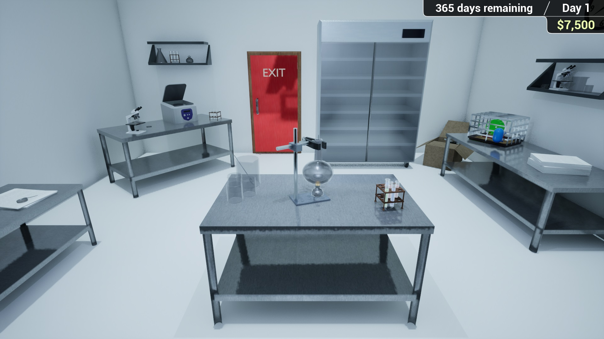
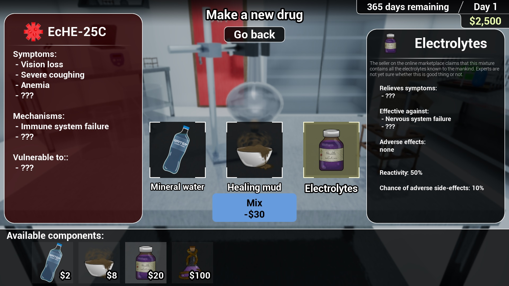

# CureIt

A casual puzzle game developed in 72 hours during a GameJam. In the game you take control of a disease research lab. Your goal is to
develop drugs against different dangerous bacteria and viruses. Combine right components to create the most effective cure for the task
and complete minigames to advance your understanding of the drug you made!

## Screenshots

**Main game view:**

**Drug creation screen:**

**Unlocking drug properties:**

You can check out the demo video of the gameplay [here](https://youtu.be/t7-betGLNuk).

## Engine

Game created using Unreal Engine 5. Editor version: 5.3.2
